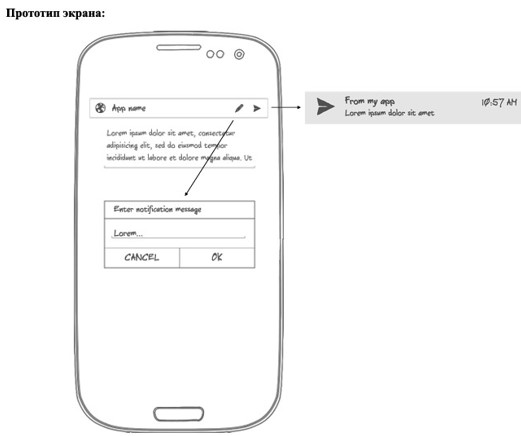
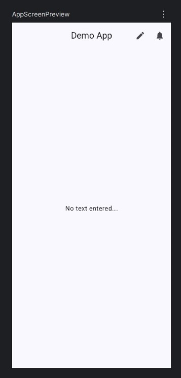
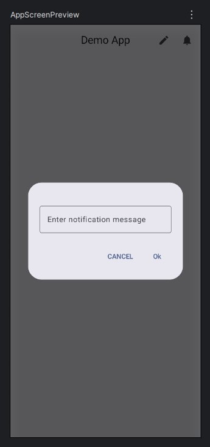

# Курс: «Разработка приложений под мобильные устройства на основе Android»

## Тема: Меню, управляющая и оповещающая информация, диалоги

Необходимо разработать приложение, которое демонстрирует вывод диалогов, оповещений и задействовать меню.  
Цель данной работы: закрепить пройденный на лекциях материал и создать собственные классы наработки для будущих проектов.

---

## Прототип экрана:

(Изображение экрана смартфона с примером интерфейса)

---

## Описание приложения:

Экран приложения представляет собой: `ActionBar` с главным меню и контентную область, в которой расположен `EditText`.  
Текстовое поле по умолчанию не имеет текста и ручной ввод отключен.

В главном меню необходимо расположить два пункта:
- **Редактировать текст**
- **Вызов оповещения**

Диалог редактирования текста состоит из заголовка, текстового поля и кнопок `OK` и `ОТМЕНА`.  
Если пользователь введет текст и нажмет `OK`, тогда указанный текст отобразится в текстовом поле контентной области активности.

Нажав на кнопку **«Вызов оповещения»**, при условии, что текстовое поле не пустое, в системе отобразится оповещение стандартного вида с указанным текстом.

